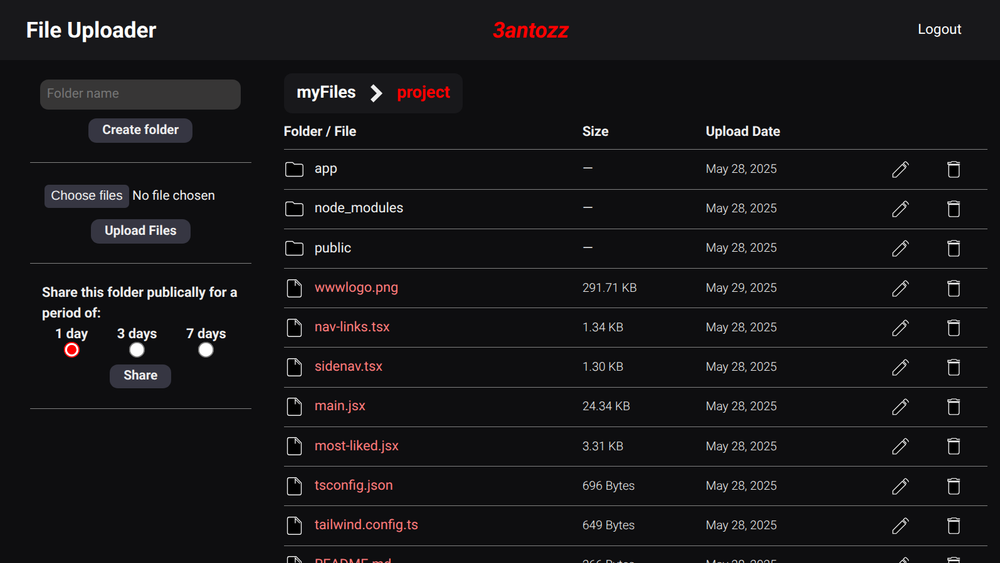

# File Uploader

A cloud personal storage application created with ExpressJS and EJS.



## Why build this project ?

This was a project assignment from The Odin Project's Node course. The brief was to create a stripped down version of Google Drive using Express and the templating engine EJS.

# [Live Preview](https://file-uploader-ifat.onrender.com/)

> [!NOTE]
> App is hosted with free tier services, first load might take some time.

## Features

- Authentification via username & password.
- Folder and file management
- Files upload and download.
- Public folder sharing with expiration duration.

## Technologies Used

### Frontend

- EJS template engine

### Backend

- Express
- Nodejs
- PostgreSQL
- Prisma ORM
- Supabase
- OnRender
- Neon

## 🛠️ How to Run the Project Locally

### Prerequisites

- [Node.js](https://nodejs.org/)
- [npm](https://www.npmjs.com/)
- [PostgreSQL](https://www.postgresql.org/) (ensure your database is running)
- Basic knowledge of using a terminal (steps are beginner-friendly)

---

### 1. Clone the Repository

```bash
git https://github.com/3antozz/File-Uploader
cd File-Uploader
```

### 2. Setup the server

```bash
cd api
npm install
```

**1- Create a .env file in the node/ directory (based on .env.example) and fill in the required environment variables such as:** 

> [!NOTE]
> This app uses supabase as storage service, if you want to test this feature locally you should acquire your own supabase credentials.

* Database connection URL
* Session secret
* Supabase URL
* Supabase KEY

2- Start the server:

```bash
npm start
```
> [!NOTE]
> The server will run on http://localhost:3000 by default.

### 3. Open in Browser

1- Once the server is running:

2- Visit http://localhost:3000 in your browser

## Libraries Used


### Frontend

- [Ejs](https://www.npmjs.com/package/ejs) –  Templating engine that generates HTML markup with plain JavaScript.

### Backend

- [bcryptjs](https://www.npmjs.com/package/bcryptjs) – For securing passwords by hashing and salting.
- [jsonwebtoken](https://www.npmjs.com/package/jsonwebtoken) – Implementation of JSON Web Token for signing tokens and authenticating users.
- [prisma/client](https://www.npmjs.com/package/@prisma/client) – ORM - Auto-generated and type-safe query builder for Node.js.
- [express-session](https://www.npmjs.com/package/express-session) – Simple session middleware for Authenticating.
- [prisma-session-store](https://www.npmjs.com/package/@quixo3/prisma-session-store) – An express session store implementation for the Prisma ORM.
- [passport](https://www.npmjs.com/package/passport) – Express-compatible authentication middleware for Node.js.
- [passport-local](https://www.npmjs.com/package/passport-local) –  Passport strategy for authenticating with a username and password.
- [date-fns](https://date-fns.org/docs/Getting-Started) – Used for manipulating JavaScript dates.
- [express-validator](https://www.npmjs.com/package/express-validator) – User input validation middleware.
- [express-async-handler](https://www.npmjs.com/package/express-async-handler) – Asynchronous exception-handling middleware.
- [cors](https://www.npmjs.com/package/cors) – Package for providing a Connect/Express middleware that can be used to enable CORS.
- [multer](https://www.npmjs.com/package/multer) – Node.js middleware for handling multipart/form-data, used for uploading files.
- [supabase/supabase-js](https://www.npmjs.com/package/@supabase/supabase-js) – Storage service integration.
